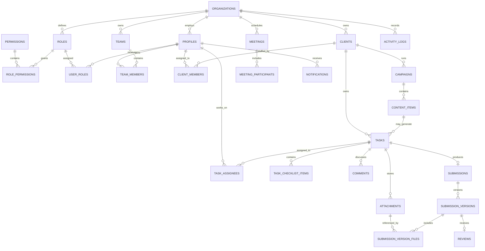

# Database schema

Phase 3 defines the first production database shape in
`supabase/migrations/202609250001_initial_schema.sql`. The schema is organized by
tenant: every business record carries `organization_id`, and cross-table foreign
keys include that tenant identifier wherever a user could otherwise connect
records from different organizations.

## Domain invariants

- Content items own `publish_at`; tasks own `due_at`. They remain separate records.
- A client can have many members, but only one active primary Account Manager.
- A task can have many assignees, but only one active primary owner.
- A task has at most one submission aggregate and any number of numbered versions.
- Submission versions and review decisions are immutable. New work creates a new version.
- Actual files live in Google Drive. `attachments` stores provider IDs and metadata.
- Employees and important business records use deactivation or soft deletion fields.
- Activity records are append-only.

## Security state

RLS is enabled on every application table in the initial migration. No access
policies are added yet, so browser/API access is denied by default. Phase 5 will
add permission-aware policies and automated isolation tests. Service-role access
must remain limited to server-only integration code.

## Local setup

1. Copy `.env.example` to `.env.local` and provide local or hosted Supabase values.
2. Install the Supabase CLI if it is not already available.
3. Run `supabase start` and then `supabase db reset` from the project root.
4. Generate database types after each schema change:
   `supabase gen types typescript --local > src/types/database.generated.ts`.

`supabase/seed.sql` creates an organization, the three base roles, their permission
maps, sample clients, campaigns, content items, tasks, and organization tools. It
does not create authentication users.
