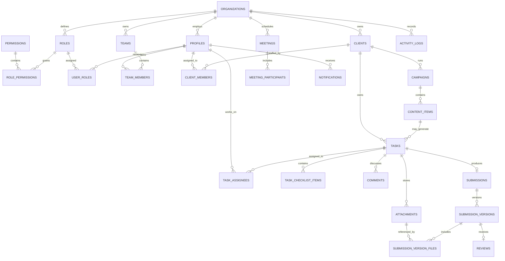

# Database schema

Phase 3 defines the first production database shape in
`supabase/migrations/202609250001_initial_schema.sql`. The schema is organized by
tenant: every business record carries `organization_id`, and cross-table foreign
keys include that tenant identifier wherever a user could otherwise connect
records from different organizations.

## Domain invariants

- Content items own `publish_at`; tasks own `due_at`. They remain separate records.
- A client can have many members, but only one active primary Account Manager.
- An Account Manager who creates a client is automatically assigned to it as the
  primary Account Manager. Supervisors have organization-wide client visibility;
  an authorized supervisor or administrator can assign multiple Account
  Managers and choose one primary. Client social platforms are stored on the
  client and included in directory search.
- A task can have many assignees, but only one active primary owner.
- A task has at most one submission aggregate and any number of numbered versions.
- Submission versions and review decisions are immutable. New work creates a new version.
- Actual files live in Google Drive. `attachments` stores provider IDs and metadata.
- Employees and important business records use deactivation or soft deletion fields.
- Activity records are append-only.

## Security state

`202609300001_auth_rls_policies.sql` adds policies across the original 29
tables. `202610110001_google_drive_private_storage.sql` adds two
service-role-only provider tables for the encrypted Google OAuth connection and
client folder IDs (31 tables after this migration).
`202610010001_persistent_task_workflow.sql` adds a task-collaborator profile
read policy and narrowly scoped RPCs for task creation, owner status changes,
comments, and checklist updates. Employees can only read tasks assigned to them
(or created by them); supervisors and administrators receive `tasks.view_all`.
Direct table writes remain revoked. File metadata is written only by
authenticated server routes after checking the user's client/task/content access.
Task submission/review remains a separate task workflow; content review is
implemented additively by `202610120001_content_item_review_workflow.sql`.
`202610190001_task_assignment_and_trash.sql` adds a permission-checked task
creation RPC that lets Supervisors/Administrators assign a standalone task to
an active member of that client, while Account Managers can create tasks for
themselves. It permits a task to have no campaign, but still requires a client.
It also adds recoverable task Trash: creators/primary assignees can move simple
tasks with no files, comments, or submissions to Trash; Supervisors and
Administrators can manage task Trash; a task with work history must be
cancelled rather than erased. Hard deletion is not provided. Apply this additive
migration to the intended hosted project before using these functions there.
`202610070001_campaign_management.sql` adds
permission-checked campaign create/update/archive RPCs. Campaigns are scoped to
an accessible, non-archived client, active names are unique per client (case
insensitive), and archive permission is separately enforced. Do not use the
service-role key in browser code; it bypasses RLS.
`202610080001_account_manager_client_ownership.sql` grants the `clients.manage`
permission to Account Manager roles and updates the client-creation RPC to add
the creator as primary client member. It stores selected social platforms and
adds a `clients.assign` permission-checked RPC for assigning multiple active
Account Managers with one primary. Supervisors retain `clients.view_all`; client
directory cards show the primary Account Manager and selected platforms, all of
which are searchable. Apply this migration before testing the updated role
workflow.

`202610090001_client_trash_and_status.sql` allows an assigned Account Manager
to change their client's status and grants a separate `clients.trash` permission
to Supervisors and Administrators. Authorized staff can move clients to Trash
and restore them; this only sets or clears `clients.deleted_at`, so linked work
is retained. Permanent client deletion and automatic purging are intentionally
not provided.

`202610050001_content_tracker_management.sql` adds revision feedback, revision
counts, next-action, and client-member assignment fields to `content_items`, with
create/update/archive RPCs that validate active membership, content permissions,
and the selected client/campaign relationship. Active client collaborators can be
assigned as content owners; their names are visible only within shared client
workspaces. The `/content` tracker uses these records, and planned/scheduled
records with publish dates appear on `/calendar`. Adding content does not create a
task automatically. `202610060001_content_tracker_csv_import.sql` adds a
permission-checked CSV import RPC with client/campaign/owner validation, a 250-row
limit, and duplicate skipping. The UI previews and maps columns before import.
`202610100001_content_workflow_alignment.sql` adds separate work and deadline
dates, client approval, client issues, notes, and the workbook's review/revision/
waiting/rejected production statuses. It also adds permission-checked workflow
RPCs and extends CSV import to preserve those fields and the source revision
count. The migration is local and must be applied before these new fields are
available in a hosted database. XLSX import and richer revision history remain
later slices. `202610120001_content_item_review_workflow.sql` adds direct
content-item file links, immutable content submission versions, and persistent
supervisor decisions. Its submit/review RPCs enforce client access, role
permissions, latest-version review, required change-request feedback, and
self-review blocking. The migration must be applied before the local review UI
can be used with a hosted database. Google Drive upload code is local and
requires the new storage migration plus OAuth configuration before it is usable.

The app uses Supabase Auth password sign-in, refreshed cookie sessions, and an
active `profiles`/`user_roles` membership check. Public sign-up stays disabled.
Without real Supabase environment values, local development uses the existing
demo accounts; when configured, the demo role switch is removed. The authenticated
task list and core task actions use persisted records. Client/campaign/content
management and private Google Drive file listing, upload, and authenticated
download are connected locally. Content-item uploads and persistent supervisor
review are connected locally by the `202610120001` migration. Apply the Drive
and content-review migrations and configure OAuth before using these flows
against a hosted project. Administrators can manage employee accounts at `/employees`: create
an Auth user with an initial password (minimum 8 characters), update profile/role,
and deactivate or reactivate non-administrator accounts. Delete moves an account
  to Trash, blocks app access immediately, and permits restoration for 30 days.
  The follow-up `202610040003_employee_trash_restore_state.sql` migration preserves
  the account's prior active/inactive state on restore. Supabase Cron then removes
  the Auth identity and anonymizes the retained profile tombstone so task and audit
  history remain intact. The `pg_cron` extension must be enabled in the hosted
  project for scheduled removal to run. If the Trash migration is not applied yet,
  the Employees page still loads the roster and explains that Trash is unavailable.

## Local setup

1. Copy `.env.example` to `.env.local` and provide local or hosted Supabase URL
   and publishable key. Employee account management also requires the
   service-role key; keep it server-only and never expose it in browser code.
2. Install the Supabase CLI if it is not already available.
3. Run `supabase start` and then `supabase db reset` from the project root. All
   migrations apply the schema, policies, RPCs, and hourly 30-day account purge;
   signup remains disabled.
4. Create the first Auth account in Supabase Authentication, sign in, and visit
   `/setup` to create the organization and matching active administrator
   `profiles`/`user_roles` rows. This one-time RPC is locked to the first
   authenticated account and refuses to run after an organization/profile exists.
   After that, administrators can create employee and supervisor accounts at
   `/employees`. The demo seed intentionally creates no auth accounts.
5. Users can update their own display name, job title, and HTTPS avatar URL at
   `/profile`. Email, role, and workspace membership are not editable there.
6. Generate database types after each schema change:
   `supabase gen types typescript --local > src/types/database.generated.ts`.

For an already-hosted Supabase project, apply new migration files in timestamp
order using the SQL Editor as `postgres`, including both employee Trash migrations
(`202610040002` and `202610040003`), the content tracker migration
(`202610050001`), CSV import (`202610060001`), campaign management
(`202610070001`), Account Manager client ownership (`202610080001`), client
Trash (`202610090001`), and content workflow alignment (`202610100001`). If the editor session was switched to
`authenticated`, run `reset role;` first; these migrations require owner-level
schema privileges. The account-trash migration enables `pg_cron` and schedules
the hourly purge. If the extension is unavailable, enable **Integrations > Cron**
in the Supabase Dashboard, then rerun the migration.

The local schema checker runs all migrations and verifies task/client isolation,
task/content/campaign RPCs, employee provisioning/deactivation/role changes,
trash/restore/expiry, and server-role-only permissions:
`npm run test:schema`.

`supabase/seed.sql` creates an organization, the three base roles, their permission
maps, sample clients, campaigns, content items, tasks, and organization tools. It
does not create authentication users.
